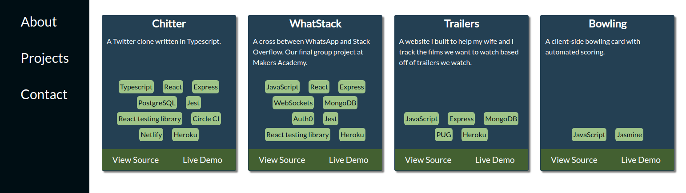

# Developer Portfolio




[](https://coveralls.io/github/PhilipVigus/dev-portfolio?branch=masters) [](https://travis-ci.com/PhilipVigus/dev-portfolio)

This repository contains my professional portfolio, a website that can currently be found [here](https://philvigus.com).

#### Technologies used

| Purpose             | Technology                  |
| :------------------ | :-------------------------- |
| Language            | JavaScript                  |
| Frontend            | React                       |
| Testing             | Jest, React Testing Library |
| Static code quality | ESLint, Prettier            |
| Test coverage       | Coveralls                   |
| CI/CD               | Travis CI, Heroku           |

#### Getting started

##### Dependencies

This project requires node and yarn to be installed.

```
# clone the repository to your local machine with either
# if you're using ssh
git clone git@github.com:PhilipVigus/dev-portfolio.git

# if you're using https
git clone https://github.com/PhilipVigus/dev-portfolio.git

# then run npm install from the project root directory
npm install

# to start a local version of the site
npm run start
```

##### Running tests

```
npm run test
```

#### My approach

One of the main aims of this project was to set up a full CI/CD pipeline, so this is the area I concentrated on first. Apart from one or two minor hiccups with authenticating Heroku to be used with Travis, I had no problems doing this.

Most of the frontend of the site was relatively straightforward to implement. However, there were a couple of issues:

###### React-router-dom and testing

One area I had issues with was the way I was testing React components that navigated between routes within the site. These tests passed when run individually, but depending on the order they were present in the file, would fail when run as a suite.

I initially thought this was a problem with asynchronous testing. However, I eventually identified that the issue was with using the wrong type of router from the react-router-dom library when testing, which meant that the browser history was not being cleared between tests. Refactoring the code to allow different types of router to be used in the tests and deployed app itself fixed the problem.

###### Working with timezones

There is a small piece of code that varies a page's content depending on the time of day. The test for this passed on my local machine, but failed on Travis. I tracked this down to being because the Travis build was being done on a machine in a different timezone, and the code I'd written did not take this into account. Once identified, I rewrote the function to be timezone independent, which allowed the test to pass.

#### Further work

- Adding a form to send emails rather than just providing an email link
- Adding more visually interesting components, such as animations
- Reworking the colour scheme
